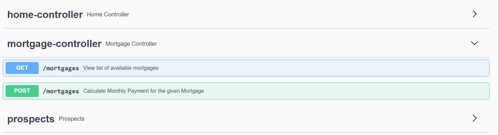

# Mortgage Plan - Project Overview

The new customer centric bank Money Bin Inc. in Duckburg would like to have new product on the market. For that they need your help! There is a demand from their customers that they want to be able to borrow money and get to know the exact amount they have to pay each month over a period of time.

The CEO of the bank has given the requirement like this:

"Given a total loan of X € and a fixed yearly interest rate of Y %. The customer wants to pay the same amount each month for Z years. How much should the customer pay each month to pay off the whole debt?"
 

 
## Input

 
## Output

 
# What's Inside?

- [ ] Technologies & Software used
- [ ] Libraries Used
- [ ] Project Structure
- [ ] Installation Procedure
- [ ] Web Interface
- [ ] Validation
- [ ] Calculation
- [ ] About Database
- [ ] Swagger Documentation

# Technologies & Software 

- [ ] Spring MVC Framework
- [ ] Spring Boot 
- [ ] ORM : Spring Data JPA with Hibernate
- [ ] Unit Testing : JUnit, Mockito
- [ ] Database : MySQL
- [ ] Java JDK 11.0
- [ ] Maven 3.8.3
- [ ] Tomcat 9.0.53
- [ ] MySQL  

# Libraries 

- [ ] JPA Repository 
- [ ] MySql Connector
- [ ] Spring devtools
- [ ] Swagger API - springfox-swagger2, springfox-swagger-ui, springfox-annotations,springfox-spring-web
- [ ] Spring validation
- [ ] Spring Boot Test
- [ ] Junit Jupiter API  
- [ ] Mockito
- [ ] Hibernate Validation API (org.hibernate), MySQL8Dialect
- [ ] Embedded container (tomcat 9) 
- [ ] Tomcat Jasper 

# Project Structure
  

# Installation Procedure

This application is packaged as a war which has Tomcat 9 embedded. No Tomcat or JBoss installation is necessary.  Make sure that the system satisfies all the software requirements mentioned above. 
A step by step procedure that tells how to get a development environment running. 

- [ ] Clone the application from Git Repository : https://github.com/YasminThameemulanzari/MortagageApp.git
- [ ] Create MySQL database
- [ ] CREATE DATABASE mortgagedb
- [ ] Create Table 

### Table Structure

- [ ] SQL to create table

        CREATE TABLE `mortgagedb`.`mortgage` (
          `Customer_ID` INT NOT NULL AUTO_INCREMENT,
          `Customer_Name` VARCHAR(45) NOT NULL COMMENT 'Customer Name',
          `Total_Loan_Amount` DOUBLE NOT NULL COMMENT 'Total Loan Amount',
          `Interest_Rate` DOUBLE NOT NULL COMMENT 'Iinterest rate in %',
          `Years` INT NULL,
          `Fixed_Monthly_Payment_Amount` DOUBLE NOT NULL COMMENT 'Fixed_Monthly_Payment_Amount',
          PRIMARY KEY (`Customer_ID`))
        COMMENT = 'Customer mortgage_plan for Money Bin Inc';

- [ ] Change MySQL username and password if required.
- [ ] Change Application Configuration :  src/main/resources/application.properties

          spring.jackson.serialization.fail-on-empty-beans=false
          spring.jpa.hibernate.ddl-auto=none
          spring.datasource.url=jdbc:mysql://localhost:3306/mortgagedb
          spring.datasource.username=root
          spring.datasource.password=****
          server.port=8081
          springfox.documentation.swagger.v2.enabled=true
          springfox.documentation.swagger-ui.enabled=true

- [ ] Change spring.datasource.url as per your MySQL JDBC configurations. 
- [ ] Change spring.datasource.username and spring.datasource.password as per your MySQL installation.	
- [ ] Change server.port to different port as per your requirement(Default port is 8080)

## Build and run the application 

- [ ] Option 1: Using IDE
            Execute the main method in the com.moneybin.mortgageplan.api.MortgageApplication class from IDE. The mortgage application will start running at http://localhost:8081 as the port was setup to 8081 in application.properties.
- [ ] Option 2:  Using maven build tool 
  - [ ] mvn clean compile package
  - [ ] mvn spring-boot:run        	(The app will start running at http://localhost:8081 ) 
  
- [ ] Option 3: Using Jar file : java -jar target/mortgage-plan-application.jar

- [ ] Option 4: Using Jenkins 

# Web Interface
As part of this Mortgage Application, Web Interface has been designed to calculate “Fixed monthly payment” by entering all required information for the calculation. 
On successful launch of this application will result in web interface which can be accessed via endpoint http://localhost:8081/home

		

# Validation

Customer has to enter all the mandatory fields in this home page. Necessary field level validations have been and appropriate error messages are displayed. 

Note: Considering the time and deadline, Only backend validation has been done at Mortgage REST API, Frond end validation has not been done as the main goal of the project is to validate the REST API which is created in Spring Boot. 

  
 
# Calculation
By submitting the form with all valid values will invoke the REST API at the backend which is developed in Spring Boot to calculate the mortgage fixed monthly payment amount and store the results in MySQL database. 
 
 
  
# Prospects
The list of all available prospects can be viewed using endpoint http://localhost:8081/prospects as shown below. 

 
# Fetch mortgages
List of all available mortgages which contains prospect information in JSON format can be accessed via endpoint http://localhost:8081/mortgages as shown below. 

# About Database
On Successful save Operation of Mortgage REST API (POST), the mortgage details will be stored in MySQL database at the backend.
SELECT * FROM mortgagedb.mortgage;

 
# Swagger Documentation
Swagger API Documentation is enabled for this Mortgage Application to help understanding about the different endpoints and Interfaces.
Endpoint to get Swagger API Documentation:
 http://localhost:8081/swagger-ui/#/mortgage-controller/getUsingGET
 

